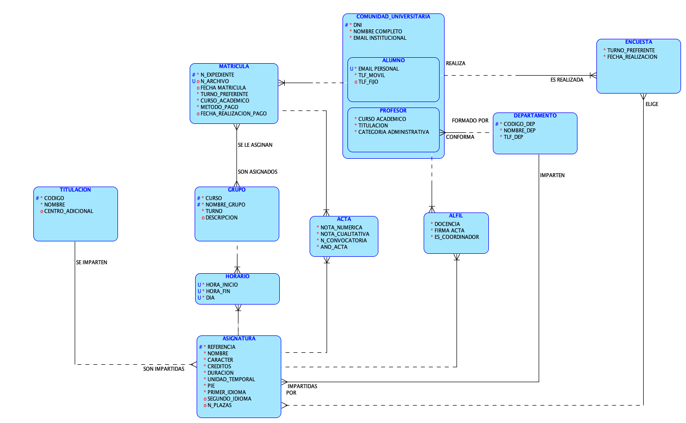

# Secretaría UMA Base de datos Software 2A grupo 7

## Contenidos

- [Video del proyecto](https://web.microsoftstream.com/video/ad6e3f9d-e272-42fb-a768-2b4169fe7393)
- [Enunciado del problema](Enunciado/)
- [Modelo relacional Oracle Datamodeler](SecretariaUMA.dmd)

